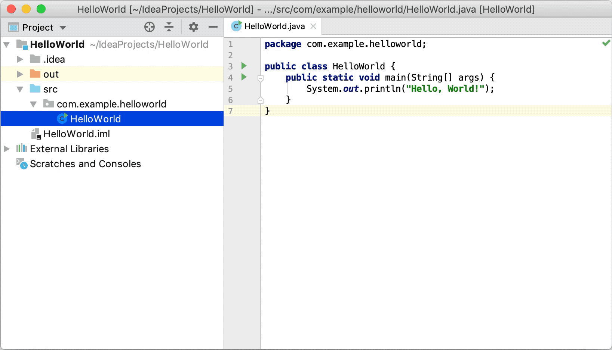

## مقدمه

فرض کنید به عنوان یک توسعه‌دهنده می‌خواهید پروژه خودتون رو برای استفاده کاربر منتشر کنید. آیا پروژتون رو با ده‌ها یا صدها کلاس نوشته شده در فولدرهای مختلف در اختیار کاربر قرار می‌دید؟ نه! اینجاست که باید با `jar` آشنا بشید.
فایل `jar` یک فایل فشرده‌شده است که کلاس‌های جاوا، عکس، متن و... به همراه فایل _Manifest_(در ادامه بهش می‌رسیم) را در خود جای می‌دهد و از فرمت‌های فشرده‌سازی مانند `zip` استفاده می‌کند.

## ساختن فایل `jar`

برای شروع اول مطمئن بشید که `JDK` روی سیستمتون نصب است. از این [لینک](https://l.vrgl.ir/r?ad=1&l=https%3A%2F%2Fwww.oracle.com%2Fjava%2Ftechnologies%2Fdownloads%2F&si=dawcnbxn3zqy&st=post&u=jydctt1aaupa&k=zEhPRO4HIYSTabDANP4zEr7E9E4aFaYnCnHop7PF99I%3D) می‌تونید نسخه مورد نظرتون رو دانلود کنید.
برای ساخت فایل `jar` کافیست به فولدری که فایل‌ها و کلاس‌ها قرار گرفته‌اند برویم و با دستور زیر در محیط ترمینال فایل `jar` ساخته می‌شود:

Syntax:
```bash
jar -cf jarfilename inputfiles
```

- `jarfilename`: نام فایل خروجی 
- `inputfiles`: نام فایل‌هایی است که قرار است فشرده شوند
- `-c`: یک فایل آرشیو خالی و جدید می‌سازد
- `-f`: مشخص می‌کند پس از آن، نام فایل خروجی به عنوان پارامتر دریافت شود


## مثال از ساخت فایل `jar`


در اینجا ما با دو فایل `JavaClass1.class` و `JavaClass2.class` روبه‌رو هستیم و با دستور زیر یک فایل `jar` ساخته شده:

```bash
jar -cvf export.jar *.class
```

استفاده از `v-` فرایند فشرده‌سازی را در خروجی نمایش می‌دهد.
اگر تعداد زیادی فایل کلاس را می‌خواهید در فایل `jar` قرار دهید می‌توانید از `class.*` استفاده کنید به جای اینکه تک تک نام فایل‌ها را بنویسید.

## مشاهده محتوای فایل `jar`

پس از آنکه یک فایل `jar` بدست آمد، برای دیدن فایل‌های موجود در آن از دستور زیر استفاده می‌شود:

Syntax:
```bash
jar -tf jarfilename
Example:
jar -tf export.jar
```

خروجی:
```bash
META-INF/
META-INF/MANIFEST.MF
JavaClass1.class
JavaClass2.class
```

یک فایل `jar` به طور پیش فرض دارای فایل Manifest می‌باشد و همیشه در فولدر `META-INF` قرار دارد.

## استخراج کردن فایل `jar`

برای extract کردن از دستور زیر استفاده می‌شود:

Syntax:
```bash
jar -xf jarfilename
Example:
jar -xf export.jar
```

برای extract کردن حتی می‌توان از ابزارهایی که یک فایل `zip` را extract می‌کنند، استفاده کرد.

## آپدیت کردن فایل `jar`

اگر پروژه‌ی ما یک پروژه‌ی حجیم و بزرگی باشد، پس از تغییراتی که در پروژه اعمال می‌کنیم، برای تبدیل آن به فایل جدید `jar` زمان طولانی‌ صرف می‌شود. در اینجا بهتر است به جای ساختن یک فایل جدید `jar`، فایل قبلی را آپدیت بکنیم.
برای آپدیت کردن محتوای فایل از دستور زیر استفاده می‌کنیم:

Syntax:
```bash
jar -uf jar-file input-file(s)
```

Example:
```bash
java -uf export.jar *.class
```

بعد از نوشتن نام فایل `jar` مورد نظر، فایل‌ها و کلاس‌هایی را که می‌خواهیم آپدیت بکنیم می‌نویسیم. این امکان باعث می‌شود تا به جای اینکه دوباره تمام فایل‌ها را فشرده بکنیم، فقط فایل‌هایی که تغییرات داشتنند را جایگزین فایل‌های قبلی در `jar` بکنیم.

## قابلیت اجرا شدن فایل `jar`

پیش از آنکه یاد بگیریم چگونه یک فایل `jar` را اجرا کنیم، باید آن را برای اجرا شدن آماده‌سازی کنیم.
فرض می‌کنیم در پروژه، کلاسی با نام `Main.class` ساخته‌ایم و در آن متد `main` را پیاده‌سازی کرده‌ایم. اکنون باید به فایل `jar` بفهمانیم که متد `main` در چه کلاسی قرار دارد تا هنگام اجرا شدن `jar`، آن را اجرا کند. با استفاده از دستور زیر هنگام ساخت فایل `jar` این امکان را اضافه می‌کنیم:

Syntax:
```bash
jar -cfe jarfilename mainclass import-files
```

Example:
```bash
jar -cfe export.jar Main client.class server.class logo.jpeg
```

توجه کنید که کلاس `Main` بدون `class`. نوشته می‌شود.
روش دیگری هم برای اضافه کردن `Main` وجود دارد که در ادامه در مبحت Manifest به آن می‌رسیم.


اکنون می‌توان فایل `jar` خود را با دستور زیر اجرا کرد:

Syntax:
```bash
java -jar jarfilename
```

Example:
```bash
java -jar export.jar
```

## فایل Manifest

زمانی که یک فایل `jar` ساخته می‌شود به صورت اتوماتیک در آن فایل Manifast هم ساخته می‌شود. حالا اصلا Manifast چی است؟


هر فایل `jar` یک فایل Manifest دارد که جزئیات و اطلاعات آن در Manifest نوشته شده است. نام این فایل به صورت پیش فرض `MANIFEST.MF` نام‌گذاری شده و در فولدر `META-INF` قرار دارد. در تصویر بالا نمونه‌ای از این فایل آمده‌است؛ حتی می‌تواند شامل جزئیات بیشتری باشد.
ورودی فایل Manifest از دو قسمت تشکیل شده است، نام و مقدار. نوشتن نام و مقدارهای Manifest چند نکته دارد که به آن می‌پردازیم:
 باید یک اسپیس پس از `":"` و قبل از مقدار باشد.
بعد از آخرین خط، یک خط باید خالی باشد.
متن باید از انکودر UTF-8 استفاده کند.
وقتی کلاس `main` را مشخص می‌کنیم نباید پسوند `class.` را پس از آن بنویسیم.


## آپدیت کردن فایل Manifest


اگر فایل `jar` را ساخته‌ایم و می‌خواهیم تغییراتی روی فایل Manifest بدهیم؛ ابتدا یک فایل `txt.` می‌سازیم و سپس برای اعمال تغییرات از دستور زیر استفاده می‌کنیم:

Example:
```bash
jar -ufm export.jar manifest.txt
```

شناساندن کلاس `main` از طریق Manifest
در قسمت‌های بالاتر توضیح داده شد که چگونه هنگام ساخت یک فایل `jar`، کلاس `main` را برای اجرا شدن به آن اضافه کنیم. حال اگر فایل `jar` را قبلا ساخته باشیم و کلاس `main` را به آن اضافه نکرده باشیم، کافیست خط زیر را به فایل Manifest اضافه کنیم:

```txt
Main-Class: Main
```

حتما دقت کنید که `class.` پس از آن را نباید بنویسیم.

## استفاده از IDE

تا به این جا با `jar` و با انواع دستورهاش آشنا شدیم. اگر پروژه‌ی ما از کتابخانه‌های خارجی استفاده می‌کرد، قرار دادن این کتابخانه‌ها در فایل `jar` کمی پیچیده می‌شد. محیط‌های توسعه قابلیت‌های پیشرفته‌ای در اختیارمان قرار می‌دهند که کار را برای ما ساده‌تر می‌کنند. در این قسمت ساختن یک فایل `jar` را در IntelliJ بررسی می‌کنیم.




ابتدا از نوار بالا گزینه File را انتخاب می‌کنیم و به قسمت Artifacts می‌رویم.
روی علامت + و سپس روی `jar` کلیک می‌کنیم. گزینه‌ی From modules with dependencies انتخاب می‌کنیم.
در فیلدهای پیش رو می‌توان کلاس Main را انتخاب کرد.
در انتها روی OK کلیک می‌کنیم.
در صفحه اصلی نرم‌افزار از نوار بالا روی Build و سپس Build Artifacts کلیک می‌کنیم.
فایل `jar` مورد نظر را انتخاب کنید تا فرایند ساخت فایل `jar` آغاز شود.
فایل‌های `jar` به طور پیش فرض در مسیر `out/artifacts` قرار می‌گیرد.

## منابع

- [Working with JAR and Manifest files In Java - GeeksforGeeks](https://l.vrgl.ir/r?ad=1&l=https%3A%2F%2Fwww.geeksforgeeks.org%2Fworking-with-jar-and-manifest-files-in-java%2F%3Fref%3Dlbp&si=dawcnbxn3zqy&st=post&u=jydctt1aaupa&k=lV3wdmWItJOUS2ZTmu7Mbxi8q768VwYXma3oyBk7%2BvA%3D)
- [Jar files in Java - GeeksforGeeks](https://l.vrgl.ir/r?ad=1&l=https%3A%2F%2Fwww.geeksforgeeks.org%2Fjar-files-java%2F&si=dawcnbxn3zqy&st=post&u=jydctt1aaupa&k=nSUeolF%2BPh3%2BSMBYf8yiWt92qVhKIH%2Fe8smJT3OnP4k%3D)
- [Compile and build applications with IntelliJ IDEA | IntelliJ IDEA](https://l.vrgl.ir/r?ad=1&l=https%3A%2F%2Fwww.jetbrains.com%2Fhelp%2Fidea%2Fcompiling-applications.html%23package_into_jar&si=dawcnbxn3zqy&st=post&u=jydctt1aaupa&k=ZM3j83yE%2BxkZI%2FTeWl7DsxIk6JrE5v30ukuxTOz5PpE%3D)
- [JAR (file format) - Wikipedia](https://l.vrgl.ir/r?ad=1&l=https%3A%2F%2Fen.wikipedia.org%2Fwiki%2FJAR_%28file_format%29&si=dawcnbxn3zqy&st=post&u=jydctt1aaupa&k=8feSlLXxMomzn5C13zX8DH%2FpN25TZ3dPhrHW%2FuF%2BM04%3D)