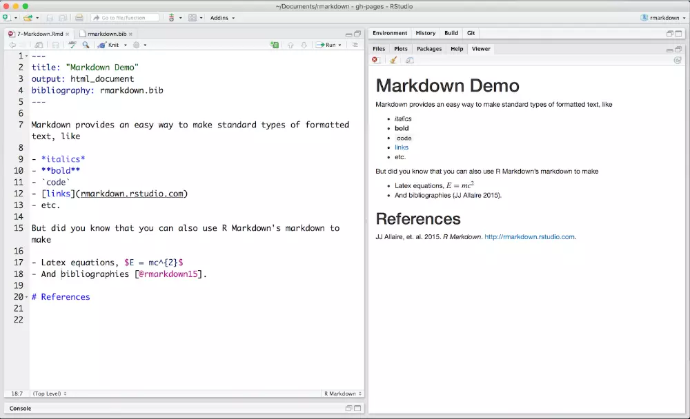

## مقدمه

احتمالا توی گشت و گذارتون در وب، این لوگوی خوشگل فایل Markdown رو دیدید! یا با فایل‌هایی رو به رو شدید که پسوند `md.` داشتن. اینجا می‌خوام یکم درباره‌ی کاربرد Markdown و سینتکس نوشتنش حرف بزنم.


## چرا از Markdown استفاده کنیم؟

شاید براتون عجیب بیاد که چرا باید به خودمون زحمت بدیم تا همچین متنی رو بنویسیم؛ چرا از ادیتورهایی مثل Microsoft Word استفاده نکنیم تا تنها با چند کلیک ساده یه عبارت رو bold کنیم؟

اینجا چندتا علت رو بررسی می‌کنیم تا به تفاوت‌هاشون پی ببریم:

- متن Markdown می‌تونه توی هر چیزی استفاده بشه. مثل سایت‌ها، مستندات، کتاب‌ها، ایمیل‌ها و خیلی چیزای دیگه. از این جهت کاربرد گسترده‌تری داره

- متن Markdown وابسته به پلتفرم نیست. شما می‌تونید Markdown رو در وب یا روی هر دستگاهی با هر سیستم عاملی باز کنید و بخونید. ولی مثلا تجربه منتقل کردن یک فایل Word رو روی دستگاه دیگه‌ای حتما داشتین؛ فونت بهم می‌ریزه، جمله‌ها می‌پرن.

- ادیتورهای متنی مثل word دیتا رو به شکل باینری ذخیره می‌کنند و تنها با خود همون ادیتور اجرا میشه ولی اگر یک فایل Markdown داشته باشین به راحتی میشه حتی توی محیط ترمینال بخونیم و تغییر بدیم.

- وب‌سایت‌هایی مثل [GitHub](https://github.com) به شکل ویژه‌ای از Markdown پشتیبانی می‌کنن. مثلا اگر با گیت‌هاب کار کرده باشید برای معرفی مخزن خود، فایلی با فرمت Markdown قرار می‌دین.


## سینتکس نوشتاری Markdown



چندتا از سینتکس‌های ساده رو بررسی می‌کنیم:

### تیتر

```md
# Heading level 1
## Heading level 2
### Heading level 3
#### Heading level 4
##### Heading level 5
###### Heading level 6
```

نتیجه:

# Heading level 1
## Heading level 2
### Heading level 3
#### Heading level 4
##### Heading level 5
###### Heading level 6

### ضخیم

```md
**Bold Text**
```


**Bold Text**


### مورب

```md
_Italic Text_
```


_Italic Text_


### ضخیم و مورب

```md
**_Bold and Italic text_**
```


**_Bold and Italic text_**


### لینک

```md
[Google](https://www.google.com)
```

[Google](https://www.google.com)

### جدول

```md
|name|age|
|---|---|
|moein|21|
|ali|20|
```

|name|age|
|---|---|
|moein|21|
|ali|20|