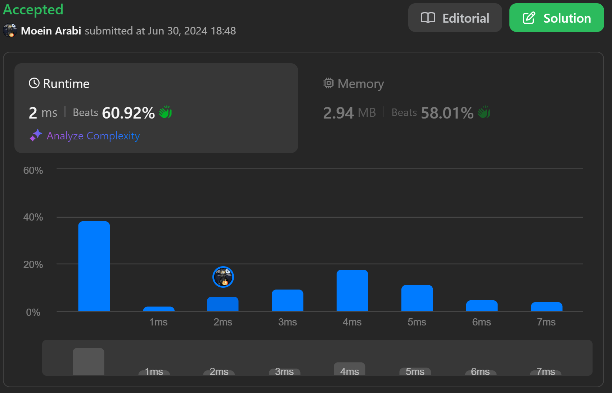
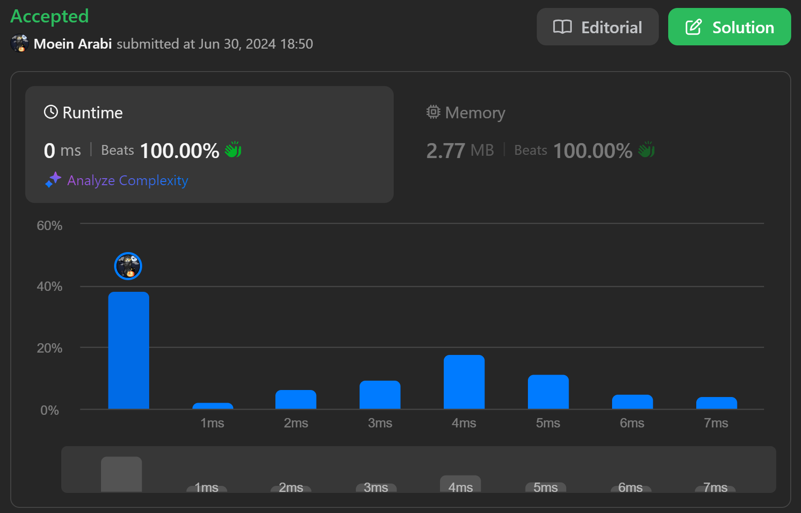

## چی شده بود؟

داشتم یکی از مسائل [Leetcode](https://leetcode.com/problems/valid-sudoku/submissions/1304929030/) رو با گو حل می‌کردم که بعد از ارسال کردن کد و Accept شدنش، تصمیم گرفتم یکم کدم رو بهینه‌تر کنم.




من همیشه عادت داشتم مسئله‌های الگوریتمی رو با پایتون حل کنم ولی از موقعی که شروع کردم به یاد گرفتن گو، از گو استفاده می‌کنم و همین سطح پایین‌تر بودن گو باعث شده به بهینه‌ بودن بیشتر فکر کنم.

## کد غیر بهینه

کدی که برای این مسئله زده بودم رو این پایین می‌بینید. از دیدنش وحشت نکنید 😊 اگر گو بلد نیستید یا کد خیلی طولانیه، قرار نیست بفهمید چیه. صرفا همین رو در نظر داشته باشید که چند حلقه `for` تو در تو داره که در هر پیمایش یک Hash-map رو دوباره می‌سازه و <cite>زباله روب[^1]</cite> عزیز بابد زحمت بکشه Hash-map قبلی رو پاک بکنه.

[^1]: Garbage Collector

همونطور که مشخصه متغیری به اسم `seen` داریم که چند بار در حال از بین رفتن و ساخته شدن است.


```go
func isValidSudoku(board [][]byte) bool {
	for _, row := range board {
		seen := map[byte]struct{}{}
		for _, column := range row {
			if column == '.' {
				continue
			}
			if _, ok := seen[column]; ok {
				return false
			}
			seen[column] = struct{}{}
		}
	}

	for column := 0; column < 9; column++ {
		seen := map[byte]struct{}{}
		for _, row := range board {
			if row[column] == '.' {
				continue
			}
			if _, ok := seen[row[column]]; ok {
				return false
			}
			seen[row[column]] = struct{}{}
		}
	}

	for i := 0; i < 9; i += 3 {
		for j := 0; j < 9; j += 3 {
			seen := map[byte]struct{}{}
			for k := i; k < i+3; k++ {
				for l := j; l < j+3; l++ {
					if board[k][l] == '.' {
						continue
					}
					if _, ok := seen[board[k][l]]; ok {
						return false
					}
					seen[board[k][l]] = struct{}{}
				}
			}
		}
	}

	return true
}
```

## کد بهینه

در هر پیمایش حلقه نیاز به یک Hash-map خالی بود که  به همین خاطر من اومده بودم هر بار یک Hash-map جدید می‌ساختم. حالا کاری که انجام دادم این بود که فقط یک بار اون هم در ابتدای کد این Hash-map رو می‌ساختم و هر بار که نیاز به یک Hash-map خالی داشتم همون رو `clear` می‌کردم.

```diff
func isValidSudoku(board [][]byte) bool {
+	seen := map[byte]struct{}{}
	for _, row := range board {
+		clear(seen)
-		seen := map[byte]struct{}{}
		for _, column := range row {
			if column == '.' {
				continue
			}
			if _, ok := seen[column]; ok {
				return false
			}
			seen[column] = struct{}{}
		}
	}

	for column := 0; column < 9; column++ {
+		clear(seen)
-		seen := map[byte]struct{}{}
		for _, row := range board {
			if row[column] == '.' {
				continue
			}
			if _, ok := seen[row[column]]; ok {
				return false
			}
			seen[row[column]] = struct{}{}
		}
	}

	for i := 0; i < 9; i += 3 {
		for j := 0; j < 9; j += 3 {
+			clear(seen)
-			seen := map[byte]struct{}{}
			for k := i; k < i+3; k++ {
				for l := j; l < j+3; l++ {
					if board[k][l] == '.' {
						continue
					}
					if _, ok := seen[board[k][l]]; ok {
						return false
					}
					seen[board[k][l]] = struct{}{}
				}
			}
		}
	}

	return true
}
```

همین تغییر ریز باعث شد عملکرد کد تغییر محسوسی بکنه:



پس حواسمون به سیستم-کال‌هایی که بیهوده در روند اجرایی کد وقفه ایجاد می‌کنند باشه.