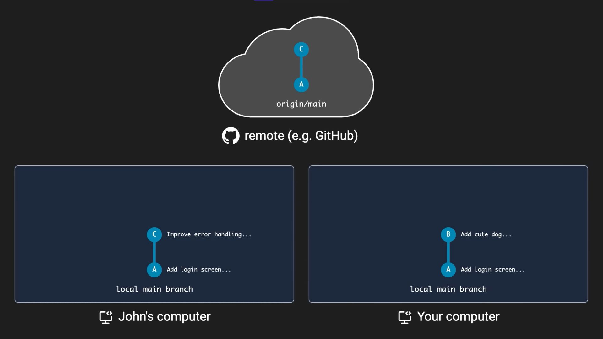
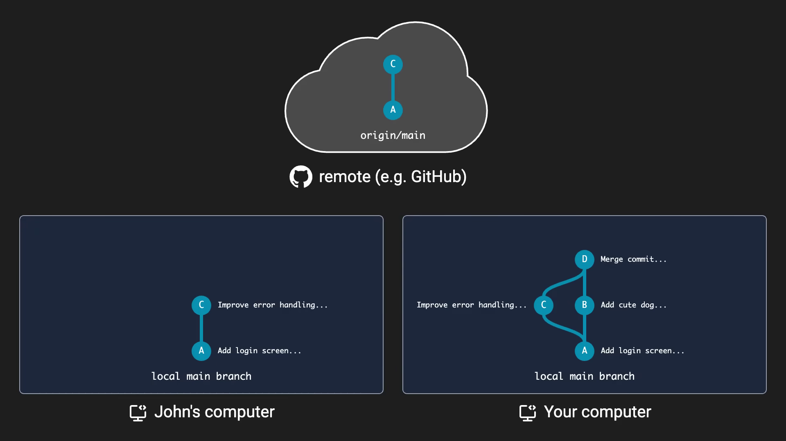
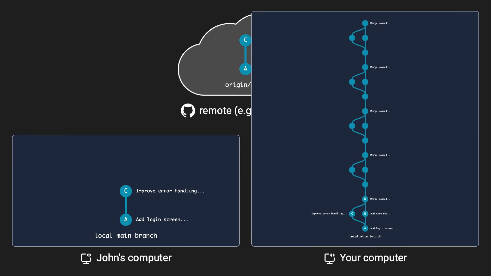
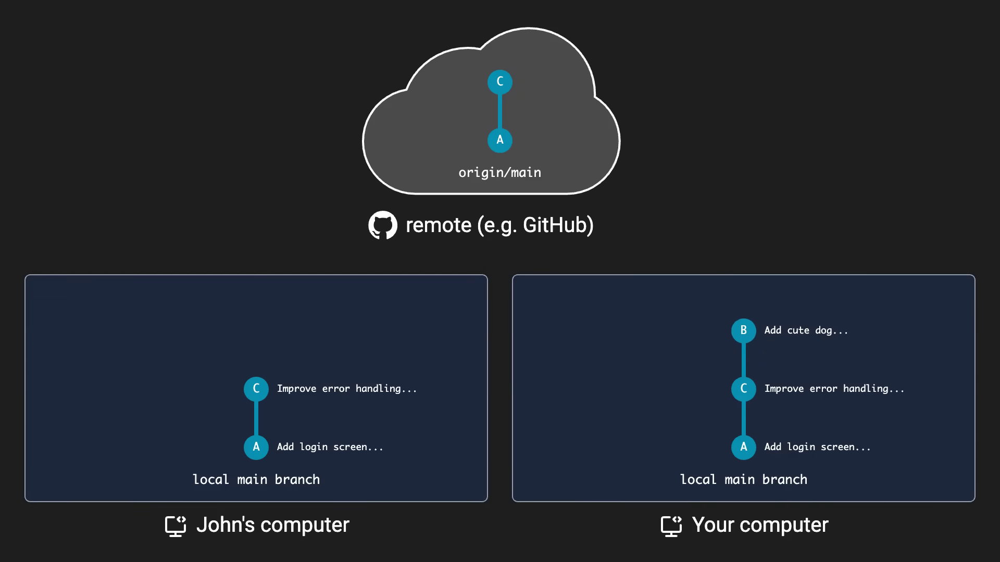

## مقدمه

> چند روز پیش به یه [ویدیو](https://www.youtube.com/watch?v=xN1-2p06Urc) با عنوان با حال "از `git pull` هیچ وقت استفاده نکن" بر خوردم. با خودم گفتم مگه چه مشکلی می‌تونه داشته باشه؟



## داستان از چه قراره؟

داستان از این قراره که همه ما وقتی میخوایم آخرین تغییرات یه رپو رو از جایی مثل گیتهاب دریافت کنیم، از دستور `git pull` استفاده می‌کنیم. این دستور در اصل دوتا دستور در دل یک دستوره. در اصل وقتی ما دستور `git pull` رو اجرا می‌کنیم، اون پشت اول دستور `git fetch` اجرا میشه که میاد برنچ ریموتی به اسم `<origin>/<branch_name>` رو توی سیستم لوکالمون آپدیت می‌کنه و بعد با دستور `git merge` این برنچ رو روی برنچ اصلی با نام `<branch_name>` مرج می‌کنه.

داستان اصلی از اینجا شروع میشه که یک **مرج** در حال اتفاق افتادنه. حالا اگر یه هم‌تیمی داشته باشیم که روی همون برنچ کامیت زده باشه، اون وقته که اتفاق خوبی نمی‌افته.



مثلا در تصویر بالا، ما یه هم‌گروهی به اسم John داریم که هر دومون از کامیت A شروع به کار کردیم. John زودتر از ما کار خودش رو انجام داده، کامیت C رو اعمال کرده و تغییرات رو پوش کرده. حالا اگر ما بخوایم تغییرات خودمون رو پوش کنیم، گیت ارور میده و از ما می‌خواد که قبلش pull انجام بدیم. اگر توی چنین شرایطی `pull` انجام بدیم، حتی اگر هم کانفلیکتی رخ نده، دو برنچ لوکال و ریموت مرج میشن. مثل عکس پایین:



یعنی یک کامیت اضافه‌تر!

حالا همین رو تصور کنید ولی با تعداد رخداد بیشتر. برنچ ما پر میشه از کامیت‌های الکی و اضافی که گراف کامیت‌ها رو کثیف می‌کنه:



نکته اینجاست که کانفلیکتی هم اگر نداشته باشیم، این اتفاق می‌افته. پس راه بهتر این جور موقع‌ها چیه؟

## راه بهتر

به جای اینکه `pull` انجام بدیم و مرج اتفاق بیفته، `rebase` می‌کنیم. `rebase` کردن باعث میشه تغییرات برنچ ریموت پشت سر کامیت ما قرار بگیره:


```bash
git pull --rebase
```



حالا ممکنه سوال پیش بیاد اگر کانفلیکت داشتیم چطور؟

ناچارن از همون دستور `git pull` استفاده می‌کنیم تا `resolve` انجام بدیم و بعدش هم مرج.